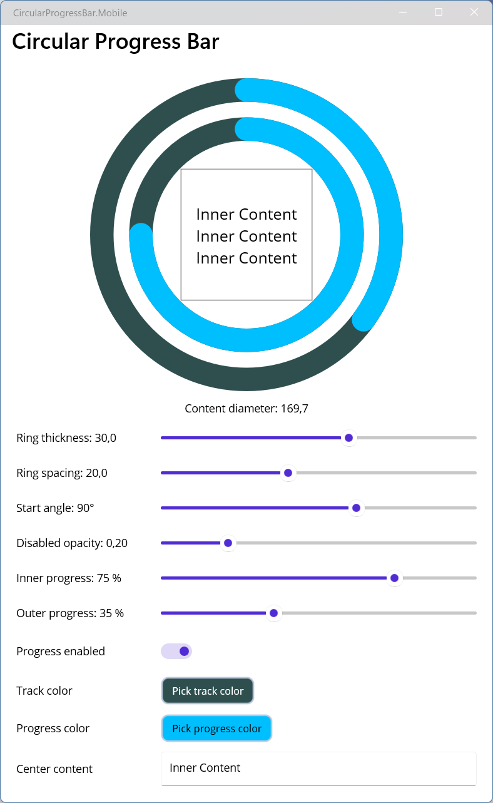

# CircularProgressBar.Maui

[](https://github.com/visviva/CircularProgressBar.Maui/actions/workflows/release.yml)
[](https://github.com/visviva/CircularProgressBar.Maui/actions/workflows/ci.yml)
[](https://github.com/visviva/CircularProgressBar.Maui/actions/workflows/codeql.yml)
[](https://www.nuget.org/packages/CircularProgressBar.Maui)

A customizable double-ring circular progress control for .NET MAUI. It supports independent inner
and outer progress values, configurable ring geometry and colors, disabled-state opacity, and
clipped content in the center of the rings.



## Features

- Independent inner and outer progress values
- Configurable thickness, spacing, start angle, track color, and progress color
- Disabled-state opacity controlled through the standard `IsEnabled` property
- Arbitrary XAML content centered and clipped to the available inner diameter
- Bindable properties suitable for MVVM applications
- Android, iOS, Mac Catalyst, and Windows support

## Installation

Install the package from NuGet:

```shell
dotnet add package CircularProgressBar.Maui
```

No handler registration is required in `MauiProgram.cs`.

## Usage

Add the control namespace to a XAML page and configure the two progress values from `0` to `1`:

```xml
<ContentPage
  xmlns="http://schemas.microsoft.com/dotnet/2021/maui"
  xmlns:x="http://schemas.microsoft.com/winfx/2009/xaml"
  xmlns:cpb="clr-namespace:CircularProgressBar.Maui;assembly=CircularProgressBar.Maui"
>
  <cpb:CircularProgressBar
    InnerProgress="0.75"
    OuterProgress="0.35"
    RingThickness="30"
    RingSpacing="20"
    StartAngle="90"
    TrackColor="#2F4F4F"
    ProgressColor="#00BFFF"
    DisabledOpacity="0.2"
  >
    <VerticalStackLayout HorizontalOptions="Center" VerticalOptions="Center">
      <Label Text="Inner Content" FontSize="20" />
      <Label Text="75%" FontSize="28" HorizontalTextAlignment="Center" />
    </VerticalStackLayout>
  </cpb:CircularProgressBar>
</ContentPage>
```

All configurable values are bindable:

```xml
<cpb:CircularProgressBar
  InnerProgress="{Binding InnerProgress}"
  OuterProgress="{Binding OuterProgress}"
  TrackColor="{Binding TrackColor}"
  ProgressColor="{Binding ProgressColor}"
  IsEnabled="{Binding IsProgressEnabled}"
  ContentDiameter="{Binding ContentDiameter, Mode=OneWayToSource}"
/>
```

## Properties

| Property | Type | Default | Description |
| --- | --- | --- | --- |
| `InnerProgress` | `float` | `0` | Inner-ring progress, clamped from `0` to `1`. |
| `OuterProgress` | `float` | `0` | Outer-ring progress, clamped from `0` to `1`. |
| `RingThickness` | `float` | `8` | Stroke thickness of both rings. |
| `RingSpacing` | `float` | `4` | Space between the inner and outer rings. |
| `StartAngle` | `float` | `90` | Progress start angle in degrees. |
| `TrackColor` | `Color` | `DarkSlateGrey` | Color of the unfilled tracks. |
| `ProgressColor` | `Color` | `DeepSkyBlue` | Color of the progress arcs. |
| `DisabledOpacity` | `float` | `0.38` | Ring opacity when `IsEnabled` is `false`. |
| `ContentDiameter` | `float` | Read-only | Diameter available to centered content after drawing. |


## Development

```shell
dotnet tool restore
dotnet restore CircularProgressBar.Maui.slnx
dotnet build CircularProgressBar.Maui.slnx
```

See [AGENTS.md](AGENTS.md) for repository conventions and contribution guidance.

## License

Licensed under the terms in [LICENSE.txt](LICENSE.txt).
